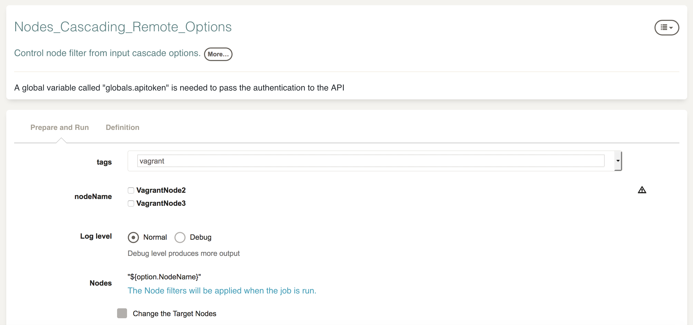
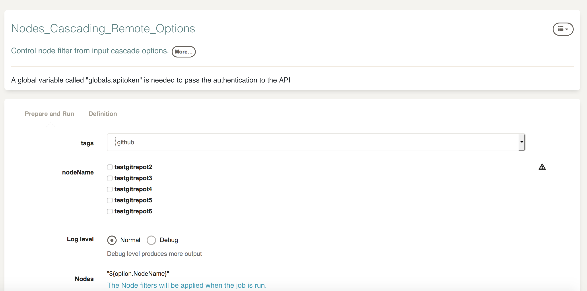

# Resource Format JSON-Option

This plugin serializes a set of Node resources into a JSON format that is compatible with [Remote option values](https://rundeck.org/docs/manual/defining-job-options.html#remote-option-values) on a Job 
For example, this plugin can help to control the node filter of a Job through input options (for example using [Cascade remote options](https://rundeck.org/docs/manual/defining-job-options.html#cascading-remote-options) )

## Build and install

To build the plugin use:

```
gradle clean build
```

To install, copy the jar file to rundeck:

```
cp build/libs/resource-format-json-option-X.X.X.jar $RDECK_BASE/libext

```

## How to use

* On the resource API URL , add the parameter `format` with the value `option-json`. For example: 

```
http://rundeck:4440/api/23/project/<Project>/resources?authtoken=<Token>&format=option-json
```

* For "cascade remote option" you can add filters like:

```
http://rundeck:4440/api/23/project/<Project>/resources?authtoken=<Token>&format=option-json&filter=tags:${option.tags.value}
```

* Set node filter as `"${option.NodeName}"` (Use double quot in case any node name of the resource has empty spaces)


See the job example on `example/Nodes_Cascading_Remote_Options.xml`






